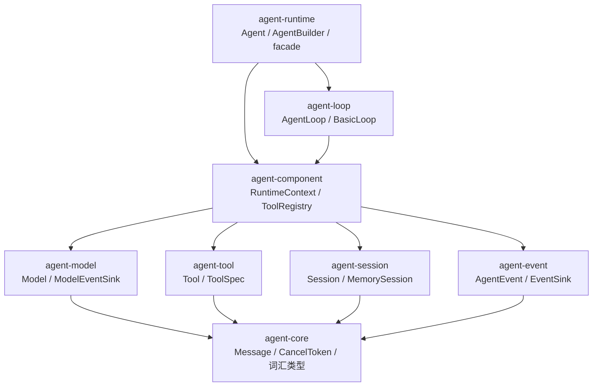

# v0 最小闭环 — 架构设计

## 概述

为 YuShan v0（最小闭环）选定最终架构：**8-crate 分层骨架（方案 B 结构）+ 同步推式事件与构建期缓存（方案 C 的资源选择）+ 方案 A 的协议修正**。三个候选由并行 subagent 按不同设计哲学生成，对比后融合。

## 设计方案

### 模块划分



| crate | 职责 | 关键类型 |
|------|------|----------|
| agent-core | 共享词汇与原语（serde 全覆盖） | Message、ContentBlock、ToolCall、ToolResult、Usage、StopReason、CancelToken、各类 ID |
| agent-event | 事件枚举与推式出口 | AgentEvent（6 变体，#[non_exhaustive]）、EventSink、NoopEventSink、CollectingSink(test) |
| agent-model | 模型口与窄模型事件口 | Model、ModelEventSink、ModelRequest/Response、MockModel（feature `test-util`） |
| agent-tool | 工具口与注册表 | Tool、ToolSpec、ToolContext<'_>、ToolRegistry（构建期查重） |
| agent-session | 会话口 | Session、MemorySession、SessionError |
| agent-component | 解析后的组件容器 | RuntimeContext<'_>、RunLimits（v2 的 Hook trait 亦规划于此） |
| agent-loop | 可替换执行策略 | AgentLoop、BasicLoop、AgentInput、RunResult、LoopError |
| agent-runtime | 组装 facade，锁定外部导入路径 | Agent（持 Box\<dyn AgentLoop\>）、AgentBuilder、BuildError、prelude |

依赖严格单向；v0 **无 tokio 生产依赖**（仅 dev-dependency 供 `#[tokio::test]`），`runtime-tokio` feature 随 v1 真实适配器引入。

### 关键数据流（BasicLoop 一回合；●=事件发射点）

0. `Agent::run_turn` 借用组件组装 `RuntimeContext`，委托给 `Box<dyn AgentLoop>`（默认 BasicLoop）
1. **入口边界**（= v2 `before_model_request` 槽位）：cancel？→ ●`RunFinished{Cancelled}`，`Ok(RunResult{rounds: 0})`——取消不是错误
2. 首轮 `session.append(input)` 成功后 ●`UserMessage`（事件 = 已发生之事，append 先于 emit）
3. 每轮：组装 `ModelRequest`（ToolSpec 已在 build() 期缓存，每轮零重建）→ `model.complete(req, &mut Forwarder)`；Forwarder 把 `ModelEvent::TextDelta` 转发为 ●`ModelTextDelta`；sink 失败 → `ModelError::Sink` → `Err(LoopError::Event)`
4. append 助手消息（**cancel 于调用期间置位时，响应仍照常 append**——不丢数据），usage 按值累加
5. 无 ToolCall → ●`RunFinished{Completed}`，`Ok(RunResult{final_message: Some})`
6. 有 ToolCall：v0 逐个串行——●`ToolCall` → registry 查名 → miss 则合成 `is_error` 结果（ADR-0001）/ 命中则 `tool.call(args, ToolContext{cancel})` → ●`ToolResult` → 全部完成后 append 单条按源顺序的 tool-result 消息 → 轮数 +1 → 回 3
7. `Err(ToolError)` → **先 append 协议配对消息（见 ADR-0004 第 6 条）：该助手消息中的每个 tool_use 都必须得到结果——已执行的用真实结果，失败与未执行的用合成 `is_error` 结果 → ●`RunFailed` → `Err(LoopError::Tool)`**；`ModelError` → ●`RunFailed` → `Err(LoopError::Model)`
8. 触顶（下一轮边界）→ ●`RunFinished{MaxRounds}`，`final_message: None`

**终局不变式**：每个 run 恰好一个终局事件（`RunFinished` 或 `RunFailed`）；错误路径先 emit 终局事件再返回 Err；若终局事件自身发送失败，只返回 Err（不重试）。

### 接口概要

```rust
// agent-core
pub struct CancelToken(Arc<AtomicBool>);                    // ADR-0002
pub enum StopReason { Completed, MaxRounds, Cancelled }
pub struct ToolResult { pub content: String, pub is_error: bool }   // core 中唯一定义，ContentBlock::ToolResult 与 Tool::call 共用

// agent-event：同步推式（零 Future 装箱，慢 sink 天然背压）
pub trait EventSink: Send {
    fn emit(&mut self, event: AgentEvent) -> Result<(), EventError>;
}
#[non_exhaustive]
pub enum AgentEvent {
    UserMessage { message: Message },
    ModelTextDelta { text: String },
    ToolCall { call: ToolCall },
    ToolResult { id: ToolCallId, result: ToolResult },
    RunFinished { stop_reason: StopReason, usage: Usage, rounds: u32 },
    RunFailed { error: String },
}

// agent-model：窄事件口与 run 级事件分离（v3 模型 ABI 最小面）
#[non_exhaustive] pub enum ModelEvent { TextDelta { text: String } }
pub trait ModelEventSink: Send {
    fn emit(&mut self, event: ModelEvent) -> Result<(), EventError>;
}
#[async_trait]
pub trait Model: Send + Sync {
    fn model_id(&self) -> &str;
    async fn complete(&self, request: ModelRequest, sink: &mut dyn ModelEventSink)
        -> Result<ModelResponse, ModelError>;
}

// agent-tool：借用 ctx（与设计文档草图一致），#[non_exhaustive] 留 v2 字段
#[non_exhaustive]
pub struct ToolContext<'a> { pub cancel: &'a CancelToken }
#[async_trait]
pub trait Tool: Send + Sync {
    fn spec(&self) -> ToolSpec;                              // 仅 build() 期调用一次并缓存
    async fn call(&self, input: serde_json::Value, ctx: ToolContext<'_>)
        -> Result<ToolResult, ToolError>;
}

// agent-session（ADR-0003 原样）
#[async_trait]
pub trait Session: Send {
    fn messages(&self) -> &[Message];
    async fn append(&mut self, message: Message) -> Result<(), SessionError>;
}

// agent-component：AgentLoop 的签名依赖它而非 agent-runtime，避免成环
#[non_exhaustive]
pub struct RuntimeContext<'a> {
    pub model: &'a dyn Model,
    pub registry: &'a ToolRegistry,
    pub session: &'a mut dyn Session,
    pub events: &'a mut dyn EventSink,
    pub cancel: &'a CancelToken,
    pub limits: RunLimits,
}

// agent-loop
#[async_trait]
pub trait AgentLoop: Send + Sync {
    async fn run_turn(&self, input: AgentInput, ctx: &mut RuntimeContext<'_>)
        -> Result<RunResult, LoopError>;
}

// agent-runtime
pub struct Agent { /* Box<dyn AgentLoop> + 组件所有权 */ }
impl Agent {
    pub async fn run_turn(&mut self, input: AgentInput) -> Result<RunResult, LoopError>;
}
pub struct AgentBuilder;   // build() -> Result<Agent, BuildError>：重复工具名、缺组件在组装期报错
```

### 实现注记（review 后补充）

- `EventError` 定于 **agent-core**：`EventSink`（agent-event）与 `ModelEventSink`（agent-model）共用，避免 model→event 依赖
- `ModelError` 需含 `Sink(EventError)` 变体：模型经 Forwarder 写 sink 失败时的错误通道
- `RuntimeContext` 与 `ToolContext` 标记 `#[non_exhaustive]` 后**不可跨 crate 字面构造**：各自提供 `new(...)` 伴生构造器
- `max_rounds` 语义 = 单回合模型调用次数上限；触顶检查发生在下一轮模型调用之前
- `Agent` 单实例同时只允许一个 run（`run_turn(&mut self)`，组件独占借用）；多 run 并发留待 v2 评估
- 同步 emit 在 async 上下文中执行，**慢 sink 会阻塞执行器线程**：v0 仅 Noop/Collecting sink；v2 起慢 sink 一律走 channel 适配器
- 测试矩阵追加（design.md §12 BasicLoop 行）：增量事件拼接结果 == 最终消息文本

## 候选方案对比

### 方案 A — 最小复杂度（2 crate）

core 吸收全部词汇、trait 与开箱实现；runtime 吸收 loop；不设 AgentLoop trait；ModelEventSink 并入 EventSink；v0 零 tokio。洞见：crate 边界晚于模块边界，出现第一个外部 trait 实现时再拆。适合快速验证型项目。被拒点：D1（2 crate）、D2（单 sink）、D3（ToolOutput 更名，实际是同一类型无需改名）、D5（去 AgentLoop trait）；采纳点：D4（ToolError 补写协议配对结果）、test-util feature、零 tokio。

### 方案 B — 可扩展优先（8 crate 分层）

完整保留 crate 树；RuntimeContext 归位 agent-component（解开 loop→runtime 环）；双事件口（窄 ModelEventSink）；Hook 点位按 design.md §6 预命名；AgentEvent #[non_exhaustive]；终局事件不变式；组装期查重。代价：双 sink 需文档固化，v0 文件仪式感偏重。

### 方案 C — 资源优先（8 crate + 零分配热路径）

同步推式 `emit(&mut self)`（零 Future Box、天然背压、Sink: Send）；build() 期缓存 ToolSpec；借用 ToolContext；全组件按独占借用进 RuntimeContext，无 Arc<Mutex>。被拒点：`Event<'a>` 借用事件（serde/回放一等要求，人体工学成本 > 微秒级收益）、`Cow<'a,[Message]>` 请求（留作 v1 优化）。采纳点：同步 emit、spec 缓存、借用 ToolContext、串行工具。

### 对比矩阵

| 维度 | A（2 crate） | B（8 crate） | C（8 crate 资源） | 融合推荐 |
|------|------|------|------|------|
| v0 代码量估算 | ~1.5k 行 | ~2k 行 | ~2.2k 行 | ~2k 行 |
| 依赖方向强制 | 模块级（约定） | crate 级（编译期） | crate 级（编译期） | crate 级 |
| 每事件开销 | ~50ns（async-trait Box） | ~50ns | ~0 | ~0（同步 emit） |
| 每轮历史拷贝 | O(n) | O(n) | O(1)（Cow 借用） | O(n)，实测瓶颈再优化 |
| v1 适配器接入成本 | 低 | 低 | 中（生命周期签名负担） | 低 |
| v2 Hook 插入成本 | 中（loop 为固有方法） | 低（边界已命名） | 低 | 低 |
| v3 模型 ABI 面 | 大（run 级事件焊进模型口） | 小 | 小 | 小 |
| 新增概念数 | 5 trait | 6 trait + 双 sink | 6 trait + 借用事件 | 6 trait + 双 sink |
| 主要风险 | 无编译期边界，后拆分触全局 | 双 sink 解释成本 | 复杂度>收益 | 同 B（已由 ADR 固化） |

**Back-of-envelope**：事件路径 ~0–50ns/事件 ≪ 模型 RTT（≥100ms），事件微优化对端到端无感；长会话 1000 条 × 2KB ≈ 2MB，每轮 owned 请求克隆 ≈ 1ms 内存拷贝——可接受；8 个小 crate 总编译时间 ≈ 单 crate + 秒级 workspace 开销，增量重编反而更快；runtime 自身常驻内存 < 1MB（不含会话与事件负载）。

## 选择理由

推荐**融合方案**：结构取 B、热路径取 C、协议修正取 A。

- 场景判断：YuShan 的产品就是「组件化结构」本身，crate 边界 = 编译期强制的依赖单向，是 AGENTS.md 第一硬约束的机械化保障。A 的「crate 边界可后补」在一般项目成立，但对以架构为产品的项目，后拆分会触及所有外部可见路径，成本被低估。
- 代价（诚实表达）：v0 需维护 8 个 crate 的结构性文件；双 sink（ModelEventSink/EventSink）形状相近会被反复质疑「为何不合一」——答案已固化在 ADR-0004（合一会把 run 级事件枚举永久焊进模型 ABI）。
- 被否方案及理由均已记录于上文与 ADR-0004，防止数月后被「修复」。

## 已知风险与待验证项

- [ ] 异步 sink（转发远端）在 v2 以 channel 适配器补齐——届时验证不破坏背压语义
- [ ] 终局事件自身 emit 失败只返回 Err：用测试锁定错误优先级
- [ ] 协作式取消最坏延迟 = 单次模型调用耗时（ADR-0002 已接受）；v1 在 runtime 层用 `tokio::select!` 验证强中断路径
- [ ] 每轮 owned `ModelRequest` 的 O(n) 克隆：会话达数千条消息时实测，瓶颈出现再引入 Cow/Arc（仅影响 loop 与适配器）
- [ ] ToolError 补写 is_error 结果后再 Err，是对 ADR-0001 后果的修订，已在 ADR-0004 说明
- 落地即验证：`BasicLoop + MockModel` 本身就是活原型，无需额外 prototype

## 相关文档

- [context.md](./context.md) — 上下文、约束与 11 项已决事项
- [ADR-0001](../../adr/0001-tool-failure-dual-channel.md) / [ADR-0002](../../adr/0002-cooperative-cancellation-in-core.md) / [ADR-0003](../../adr/0003-session-append-async-result.md) — 锁定决策
- [ADR-0004](../../adr/0004-v0-layered-skeleton-and-sync-events.md) — v0 骨架决策
- `docs/design.md` — 总体设计（§9 crate 树、§6 Hook 点位）
- 调研来源：pi（本地 `tmp/pi`，事件/Hook 分层与错误回喂）、[rig](https://rig.rs/)（多 crate + sans-I/O run state + typed hooks）、[OpenAI Agents SDK](https://openai.github.io/openai-agents-python/)（loop 即 primitive）、[pydantic-ai](https://github.com/pydantic/pydantic-ai)（类型即 schema、FSM）
