# YuShan 架构图说

> 用图解释设计。**规范细节**见 `docs/design.md`；**as-built 实现形态**（含实现与设计的分歧）见 `docs/design-final/core-channel.md`；术语见 `docs/CONTEXT.md`；决策的 why 见 `docs/adr/`。
>
> 本文只回答「**长什么样、怎么流动**」。

## 目录

1. [分层与依赖](#1-分层与依赖)
2. [组件关系](#2-组件关系运行时静态结构)
3. [一次 run 的完整时序](#3-一次-run-的完整时序)
4. [出站数据流：事件](#4-出站数据流事件)
5. [入站数据流：队列 → 会话](#5-入站数据流队列--会话)
6. [事件信道的两条路径](#6-事件信道的两条路径)
7. [流式响应路径](#7-流式响应路径sse--事件)
8. [生命周期策略](#8-生命周期策略)
9. [三种入口模式](#9-三种入口模式)
10. [`/new` 换队列](#10-new-换队列)
11. [会话落盘与恢复](#11-会话落盘与恢复)
12. [附录：测试分层](#12-附录测试分层)

---

## 1. 分层与依赖

**唯一的硬约束：依赖只能向下，不能向上。**

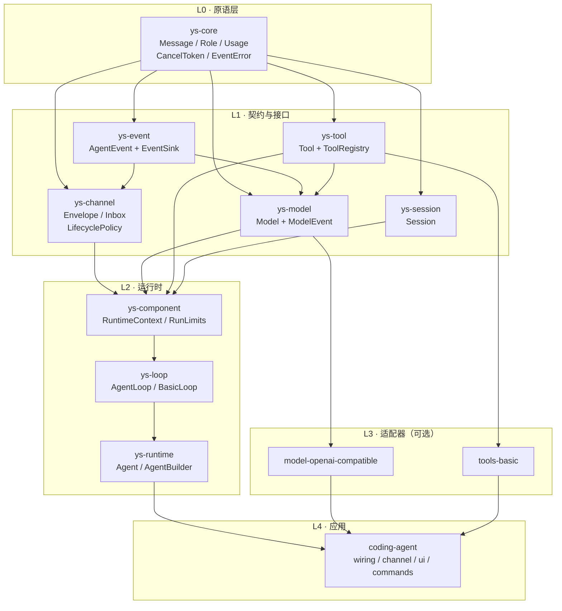

**读图要点**

| 观察 | 含义 |
|---|---|
| `ys-core` 无任何出边 | 它是最底层词汇表，零外部依赖 |
| `ys-channel` 只依赖 core + event | 它装的是**数据与枚举**，不依赖任何组件接口 |
| `ys-component` 汇聚 model/tool/session/event/channel | `RuntimeContext` 是「运行时能用到的全部东西」的容器 |
| 适配器只依赖接口层，**不依赖 `ys-runtime`** | 工具/模型不认识 Agent |
| 应用层汇聚一切 | 它是**接线器**，只做组装 |

**tokio 边界**（ADR-0012）

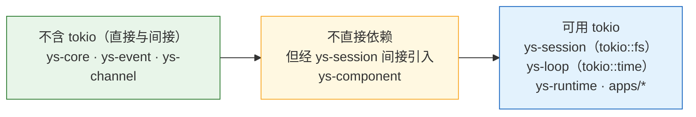

判据是「**自身代码是否使用 tokio API**」——`ys-component` 不用，但它持有 `&mut dyn Session`，而 `ys-session` 用 `tokio::fs`。

---

## 2. 组件关系（运行时静态结构）

`Agent` **不持有**会话、事件出口、模型——这三者由**接线器**持有，每次运行经端口传入。

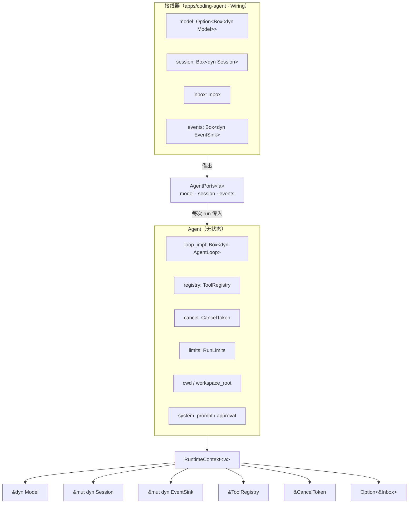

```rust
pub async fn run(&mut self, ports: AgentPorts<'_>, inbox: &Inbox) -> Result<RunSummary, LoopError>;

pub struct AgentPorts<'a> {
    pub model:   Option<&'a dyn Model>,
    pub session: &'a mut dyn Session,
    pub events:  &'a mut dyn EventSink,
}
```

**为什么要这样拆**：`Agent` 一旦「自己转」（长时间持有 `&mut self`），外部就拿不到 `&mut Agent`。若会话/模型还在 Agent 里，`/new`、`/model` 这些命令就**没有合法途径**生效。把三者外置后，命令只改接线器，agent 全程不知情（ADR-0010）。

---

## 3. 一次 run 的完整时序

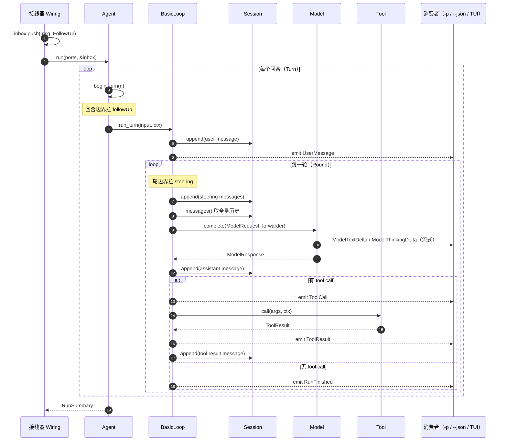

**两个边界的区别**（容易混淆）

| 边界 | 何时 | 拉哪条队列 | 语义 |
|---|---|---|---|
| **回合**（Turn） | 一个回合开始前 | `followUp` | 「等它跑完再说」—— 排队等下一趟 |
| **轮**（Round） | 每次模型调用前 | `steering` | 「agent 正在跑，我插句话」—— 中途掌舵 |

回合边界的拉取在 `Agent::run` 里；轮边界的拉取在 `BasicLoop::run_turn` 主循环里（否则 `AgentLoop` 就该感知队列，破坏分层）。

---

## 4. 出站数据流：事件

事件从模型一直流到消费者，中间经过**两次转换**。

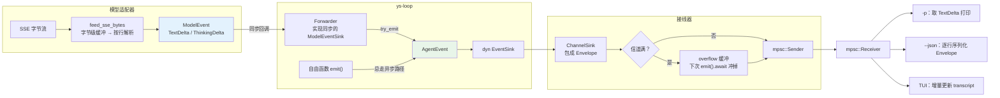

**两次转换**

```
ModelEvent          →   AgentEvent          →   Envelope
（模型层窄口）           （运行层事件）            （信道传输单位）
TextDelta               ModelTextDelta          { source, turn, event }
ThinkingDelta           ModelThinkingDelta
（工具参数增量不冒泡，适配器内组装）
```

**为什么 `ModelEventSink` 保持同步**：`Forwarder` 实现的是**同步** `ModelEventSink`。若把它改成 async，会连带改动**所有模型适配器**，并破坏 ADR-0004 点 2 为 v3 动态插件保留的「最小 ABI 面」（async trait 跨动态库边界困难）。这正是不把 `EventSink` 直接做成纯 async 的**首要理由**。

---

## 5. 入站数据流：队列 → 会话

**「队列 = 会话 = 历史」**不是一句口号，它决定了 `/new` 的实现方式。

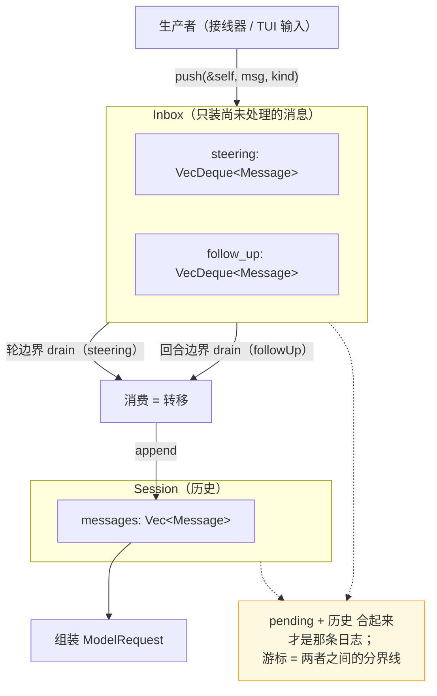

**关键性质**

| 性质 | 说明 |
|---|---|
| **转移而非拷贝** | 消息在任一时点只存一份：要么在 Inbox（pending），要么在 Session（历史） |
| **`push(&self)` 内可变** | `Arc<Mutex<Inner>>` —— 接线器可在 agent **运行期间**投递（steering 的前提） |
| **`QueueMode`** | `OneAtATime`（默认，一条一回合）/ `All`（合并为**一条** `Message`，单回合） |
| **`close()`** | 之后 `push` 静默丢弃；`take_*` 仍能取完已入队的 |

---

## 6. 事件信道的两条路径

`EventSink` 有两个方法，**各有明确归属**——搞混会导致死锁。

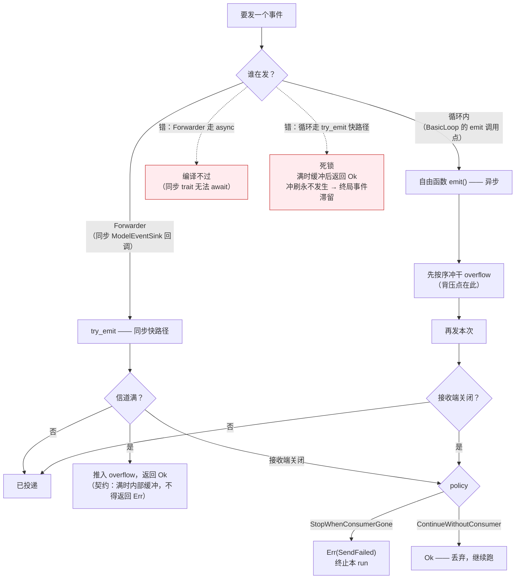

**两条铁律**（都是修过的 bug）

1. **自由函数 `emit()` 必须总走异步路径** —— 若让它先试快路径，满时 `try_emit` 缓冲后返回 `Ok`，调用方以为已投递，**冲刷永不发生** → 终局事件滞留 → 消费者等不到 → 死锁。
2. **`try_emit` 的 `Err` 仅表示「消费者已消失」** —— 信道满时实现**必须内部缓冲**。理由：同一个 `Err` 在两条路径上被相反处置（自由函数视为「走慢路径重试」，`Forwarder` 以 `let _ =` 丢弃），只有收窄成「消费者消失」二者才自洽。

**背压的作用范围**（诚实说明）

| 路径 | 满时行为 | 背压 |
|---|---|---|
| 自由函数（循环内） | 先冲 overflow（`send().await` 阻塞） | ✅ 生效 |
| `Forwarder`（同步回调） | 推入 overflow，无法 await | ❌ 不生效（overflow 上界 ≈ 单次模型响应的增量数） |

后者是「同步回调无法背压」的固有取舍，非缺陷。

---

## 7. 流式响应路径（SSE → 事件）

```mermaid
sequenceDiagram
    autonumber
    participant S as SSE 连接
    participant B as feed_sse_bytes
    participant A as StreamAccumulator
    participant K as EventSink
    participant R as ModelResponse

    loop 每个 TCP chunk（任意字节边界）
        S->>B: bytes
        B->>B: buffer.extend_from_slice(bytes)
        Note over B: 缓冲是 Vec&lt;u8&gt;，未闭合的行留在 buffer
        loop 每个完整的行（含 \n）
            B->>B: 在字节层找 b'\n'，只对完整行解码 UTF-8
            B->>A: StreamEvent::Delta
            A->>A: 累积 text / reasoning / tool_call 碎片
            A->>K: ModelEvent::TextDelta（逐块）
            A->>K: ModelEvent::ThinkingDelta（按 compat 门控）
        end
    end
    A->>R: finish() —— 组装完整 Message
    Note over R: text → ContentBlock::Text<br/>tool_calls 按 index 组装 → ToolUse<br/>usage 取末包
```

**为什么缓冲必须是字节级**：TCP 分片可能切在一个多字节字符**中间**。若对每个 chunk 单独 `from_utf8_lossy`，半个汉字会变成 U+FFFD（`你好世界` → `���好世界`）。字节级缓冲 + 只在完整行上解码，才能保证跨片字符完整。

**工具参数不进 `ModelEvent`**：设计定「工具参数不冒泡」——它按 `index` 在适配器内累积成完整 `ToolUse`，直接进 `ModelResponse`。若做成 `ModelEvent` 变体，`Forwarder` 的 `_ => Ok(())` 会吞掉它，成为 dead variant。

---

## 8. 生命周期策略

「消费者消失后怎么办」是可配策略，不是写死的规则。

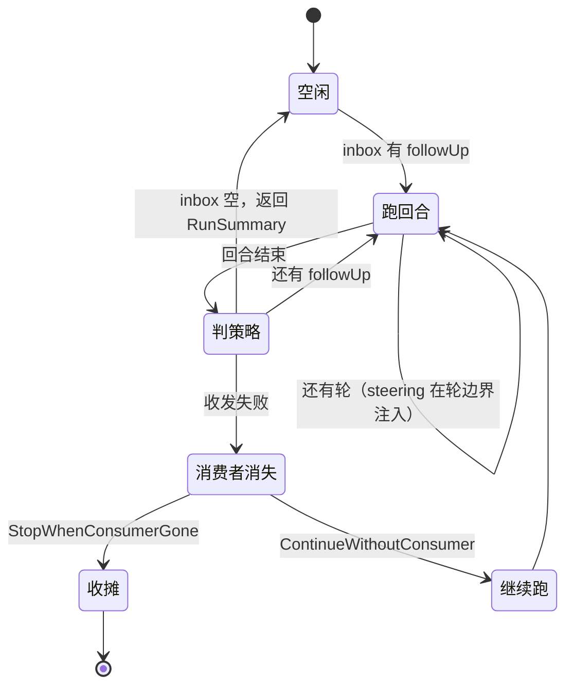

| 策略 | 消费者消失后 | 适用 |
|---|---|---|
| `StopWhenConsumerGone`（默认） | 以 `Err(LoopError::Event(SendFailed))` 终止当前 run | 交互式 CLI / TUI |
| `ContinueWithoutConsumer` | 继续跑（靠事件落盘兜底） | 后台长任务 |

**关键规则**：**消费者消失时不打断正在进行的轮** —— 干完当前轮再看策略（学 pi-server 的 *"releases its attachment only after admitted service calls settle"*）。避免把正在写的文件砍一半。

**注意「收摊」的返回类型**：是 `Err`，**不是**「与用户取消同类」——取消路径返回 `Ok(RunResult { stop_reason: Cancelled })`。二者不同。

---

## 9. 三种入口模式

三种模式**互斥**（一次跑一个），共用同一套 Agent。

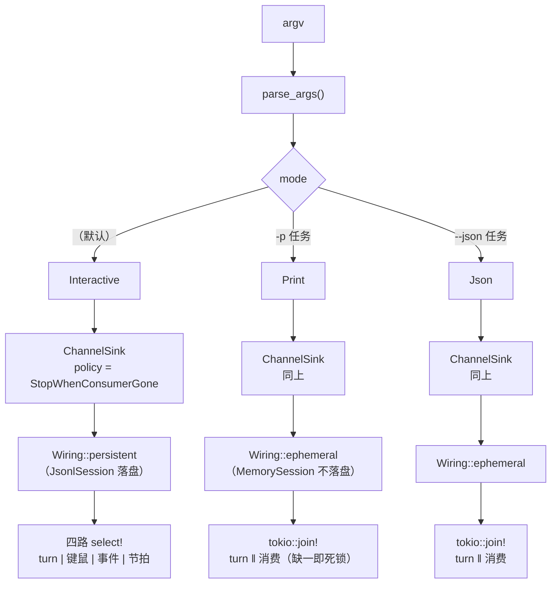

**为什么 `-p`/`--json` 必须 `join!`**：有界信道若无**并发**消费者，agent 第一次撞满就会等待 → 死锁。

**为什么消费以「终局事件」而非「信道关闭」为终止条件**：sender 在 Agent 里，Agent 不 drop 信道就不会关闭；等关闭必死锁。

**为什么 `-p`/`--json` 用 `ephemeral`**：避免把上次交互的会话历史灌进一次性任务。行为与引入前等价（此前也是 `MemorySession`）。

---

## 10. `/new` 换队列

**`/new` 不是「告诉 agent 重置」，而是「换一个队列」——agent 全程不知情。**

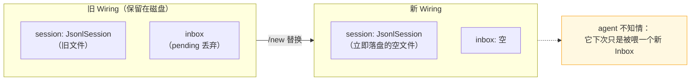

**「立即落盘空文件」是必须的**：新会话文件若惰性创建，用户 `/new` 后**没发消息就退出**，磁盘上只有旧文件 → 重启恢复到的还是旧会话 → **`/new` 等于没生效**（实测复现过的 bug）。

---

## 11. 会话落盘与恢复

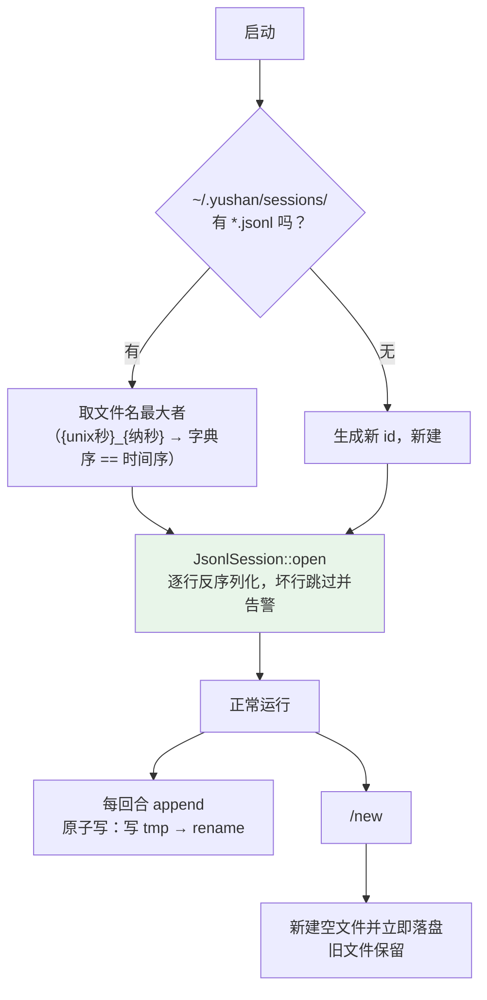

| 项 | 值 |
|---|---|
| 路径 | `~/.yushan/sessions/{unix秒}_{纳秒}.jsonl` |
| 覆盖 | 环境变量 `YUSHAN_SESSIONS_DIR`（测试用） |
| 写策略 | 原子：写 `{file}.jsonl.tmp` → `rename` |
| 损坏处理 | 跳过坏行并告警，不终止 |
| 已知缺口 | **多进程并发写同一文件无锁**（整文件重写 + 固定 tmp 名会丢更新） |

---

## 12. 附录：测试分层

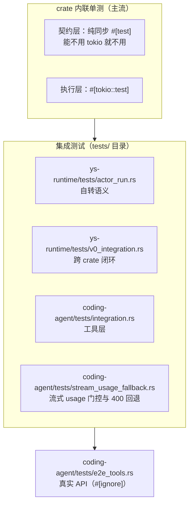

**测试替身（均为生产导出，供跨 crate 复用）**

| 替身 | 位置 | 用途 |
|---|---|---|
| `MockModel` | `ys-model` | 预写响应队列（`push_text` / `push_tool_call` / `push_error`） |
| `CollectingSink` | `ys-event` | 收集 `AgentEvent` 供断言 |
| `NoopEventSink` | `ys-event` | 静默丢弃 |
| `FailingSink` | `ys-event` | 第 N 次起失败（覆盖「消费者消失」路径） |
| `MemorySession` | `ys-session` | 内存会话 |

**两条并行安全的纪律**（都是踩过坑的）

- 临时目录名必须含**进程内原子序号 + `process::id()`** —— macOS 的 `as_nanos()` 只到微秒级，并行测试会撞名，先完成者的 `remove_dir_all` 会删掉他人的文件
- 进程级 env 改写必须走 `test_env::env_lock()` + `EnvRestore`（RAII 恢复）—— 直接 `set_var` 散在测试里会造成 `getenv`/`unsetenv` 数据竞争

**一条方法论**：关键逻辑要做**变异测试**（注入 bug 验证测试能抓到）。本项目多个真 bug（死锁、跨分片 UTF-8 损坏、`/new` 失效）**都是「测试全绿时依然存在」**，靠变异测试与端到端复现才暴露。
