# YuShan 架构图说

> **最后更新**：2026-09-14（路线 B 重构：三信道 + 两线程 + `ys-protocol` + `ys-tui-coding`）
>
> 用图解释设计。**规范细节**见 `docs/design.md`；**as-built 实现形态**（含实现与设计的分歧）见 `docs/design-final/coding-agent-tui.md`（路线 B，最新；核心信道第一刀见 `docs/design-final/core-channel.md`，其信道/actor 部分已被前者取代）；术语见 `docs/CONTEXT.md`；决策的 why 见 `docs/adr/`。
>
> 本文只回答「**长什么样、怎么流动**」。

## 目录

1. [分层与依赖](#1-分层与依赖)
2. [三信道与两线程](#2-三信道与两线程)
3. [组件关系](#3-组件关系运行时静态结构)
4. [一次 run 的完整时序](#4-一次-run-的完整时序)
5. [出站数据流：事件](#5-出站数据流事件)
6. [入站数据流（回合边界与轮边界）](#6-入站数据流回合边界与轮边界)
7. [事件信道的两条路径](#7-事件信道的两条路径)
8. [流式响应路径](#8-流式响应路径sse--事件)
9. [生命周期策略](#9-生命周期策略)
10. [三种入口模式](#10-三种入口模式)
11. [`/new` 换 Wiring](#11-new-换-wiring)
12. [会话落盘与恢复](#12-会话落盘与恢复)
13. [输出与诊断三分](#13-输出与诊断三分)
14. [`ys-tui-coding` 形态与命令分工](#14-ys-tui-coding-形态与命令分工)
15. [附录：测试分层](#15-附录测试分层)

---

## 1. 分层与依赖

**唯一的硬约束：依赖只能向下，不能向上。**

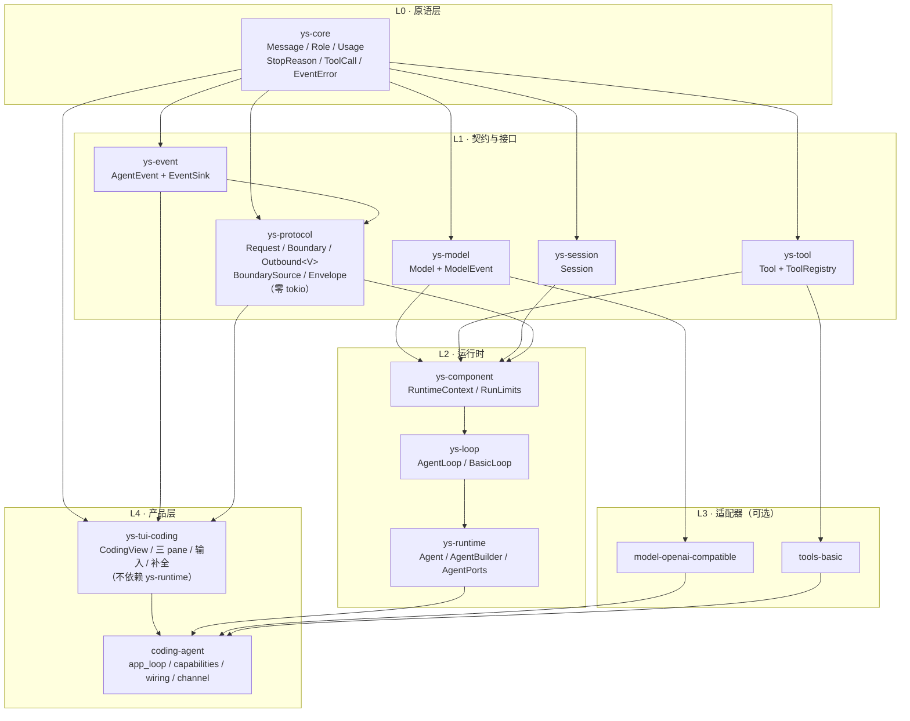

**读图要点**

| 观察 | 含义 |
|---|---|
| `ys-core` 无任何出边 | 它是最底层词汇表，零外部依赖 |
| `ys-protocol` 只依赖 core + event | 它装的是**数据与纯 trait**（能力平面/协议），不依赖任何组件接口，且**零 tokio** |
| `ys-component` 汇聚 model/tool/session/event/protocol | `RuntimeContext` 是「运行时能用到的全部东西」的容器 |
| 适配器只依赖接口层，**不依赖 `ys-runtime`** | 工具/模型不认识 Agent |
| `ys-tui-coding` **不依赖 `ys-runtime`** | TUI 不认识 `Agent` —— **编译器强制**（crate 边界），只经 `ys-protocol` 与 app 通话 |
| 应用层汇聚一切 | 它是**接线器**，只做组装 |

> `crates/ys-channel` 整 crate **已删除**（2026-09-14），其 `Envelope` / `Source` / `LifecyclePolicy`
> 三型（纯数据，零改动）随迁 `ys-protocol`；`Inbox` / `Intent` / `QueueMode` 语义消失。详见 ADR-0013。

**tokio 边界**（ADR-0012）

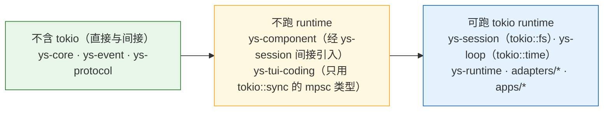

判据是「**自身代码是否使用 tokio API / 是否需要 runtime**」——`ys-component` 不用，但它持有
`&mut dyn Session`，而 `ys-session` 用 `tokio::fs`；`ys-tui-coding` 的 UI 线程是**普通同步 `fn`**，
只用 tokio 的 mpsc 类型，自己不跑 runtime。

---

## 2. 三信道与两线程

路线 B 的核心拓扑（ADR-0013）：**`ys-tui-coding` 不认识 `Agent`，故 agent 必须在另一个线程**。
两线程之间只有**三条信道** + `ys-protocol` 的纯数据类型。

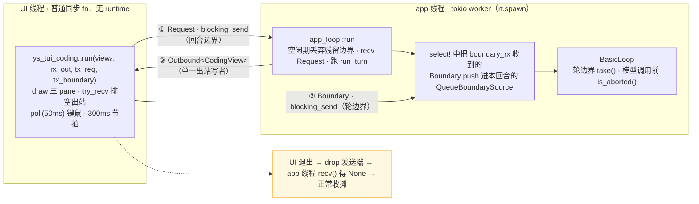

| 信道 | 类型 | 方向 | 目的地 / 消费时机 | 容量 |
|---|---|---|---|---|
| ① Request | `ys_protocol::Request` | UI → app | app 线程 `recv().await`（**回合边界**） | 64 |
| ② Boundary | `ys_protocol::Boundary` | UI → `BasicLoop` | **轮边界**拉取（`take`）；模型调用前 / 工具轮询用 `is_aborted` | 64 |
| ③ Outbound | `ys_protocol::Outbound<CodingView>` | app → UI | UI 事件循环 `try_recv` 排空 | 1024 |

**为何 ② 必须独立于 ①**：回合跑动时 app 线程阻塞在 `agent.run_turn()` 里，**不可能** `recv` ①；
而 `Steer`（插话）/ `Abort`（取消）要**中途**被看到 → 只能由 `BasicLoop` 在轮边界拉。

**为何分线程**：`ys_tui_coding::run()` 阻塞在自己的事件循环里（用 `Sender::blocking_send`），
且**不认识 `Agent`** —— 若在同一线程跑 agent，拆 crate 就成了摆设。

**单一出站写者**：`Outbound<V>` 是 UI 的唯一输入流。`ChannelSink` 仍写自己的 `Envelope` 信道，
app 侧多跑一个转发循环把它转成 `Outbound::Event`，换来事件与 `Output` 的**确定顺序**
（两条信道各排各的话，顺序无保证）。

**Drop 语义即退出信号**：UI 退出时 drop 掉 `tx_req` / `tx_boundary` → app 线程 `recv()` 得 `None`
→ `app_loop::run` 返回 `Ok(())`。无需显式关机协议。

---

## 3. 组件关系（运行时静态结构）

`Agent` **不持有**会话、事件出口、模型——这三者由**接线器**持有，每次运行经端口传入。
轮边界控制源（`boundary`）**由 app 循环每回合新建**、随手传入。

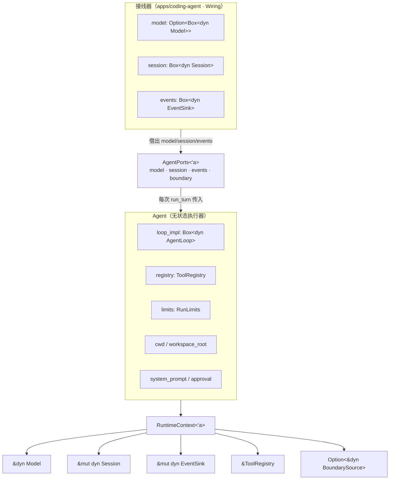

```rust
pub struct AgentPorts<'a> {
    pub model:    Option<&'a dyn Model>,          // None = 未配置，run_turn 返回 ConfigError
    pub session:  &'a mut dyn Session,             // 归接线器；/new 换的就是它
    pub events:   &'a mut dyn EventSink,           // 归接线器
    pub boundary: Option<&'a dyn BoundarySource>,  // 轮边界控制（Steer/Abort），每回合新建
}

pub async fn run_turn(&mut self, input: AgentInput, ports: AgentPorts<'_>) -> Result<RunResult, LoopError>;
```

**为什么要这样拆**：`Agent` 一旦「自己转」（长时间持有 `&mut self`），外部就拿不到 `&mut Agent`。
若会话/模型还在 Agent 里，`/new`、`/model` 这些命令就**没有合法途径**生效。把三者外置后，
命令只改接线器，agent 全程不知情（ADR-0010）。

> **附注（2026-09-14）**：`Agent::run(inbox)` 与 `RunSummary` **已删除**。**actor 循环**（多回合 /
> followUp 的驱动）**上移到 `apps/coding-agent/src/app_loop.rs`**（ADR-0010 附注、ADR-0013）。
> `Agent` 的公开面收窄为 `run_turn` + 只读查询（`tool_names` / `context_window`）——
> 「只持执行能力、不持会话」的结论**一字未改**，只是承载者换了。
> `-p` / `--json` 不再经 `Agent::run`：直接 `run_turn` + `begin_turn(1)`，一次运行恒为 turn 1。

---

## 4. 一次 run 的完整时序

```mermaid
sequenceDiagram
    autonumber
    participant U as UI 线程
    participant A as app_loop
    participant G as Agent
    participant L as BasicLoop
    participant S as Session
    participant M as Model
    participant T as Tool
    participant C as 消费者（Outbound → TUI）

    U->>A: ① Request::Prompt(msg)
    A->>A: turns += 1; events.begin_turn(turns)
    A->>A: 新建 QueueBoundarySource（每回合）
    A->>G: run_turn(input, AgentPorts::new(.., Some(&boundary)))
    Note over A: 同时 select! boundary_rx → push 进源
    G->>L: run_turn(input, ctx)
    L->>S: append(user message)
    L-->>C: emit UserMessage
    loop 每一轮（Round）
        Note over L: 轮边界 take()（Steer 注入）；模型调用前 is_aborted()
        L->>S: append(steering messages)
        L->>S: messages() 取全量历史
        L->>M: complete(ModelRequest, forwarder)
        M-->>C: ModelTextDelta / ModelThinkingDelta（流式）
        M-->>L: ModelResponse
        L->>S: append(assistant message)
        alt 有 tool call
            L-->>C: emit ToolCall
            L->>T: call(args, ctx)
            T-->>C: emit ToolResult
            L->>S: append(tool result message)
        else 无 tool call
            L-->>C: emit RunFinished
        end
    end
    G-->>A: RunResult
    A-->>C: ③ Outbound（Event / View / Output）
    A-->>U: rx_out.try_recv 更新 transcript / view
```

**两个边界的区别**（容易混淆）

| 边界 | 何时 | 拉哪条信道 | 语义 |
|---|---|---|---|
| **回合**（Turn） | 一个回合开始前 | ① `Request::Prompt` | 「等它跑完再说」—— 排队等下一趟 |
| **轮**（Round） | 每次模型调用前 | ② `Boundary::Steer` | 「agent 正在跑，我插句话」—— 中途掌舵 |

回合边界的拉取在 `app_loop::run` 里（`recv().await`）；轮边界的拉取在 `BasicLoop::run_turn`
主循环里（否则 `AgentLoop` 就该感知信道，破坏分层）。

---

## 5. 出站数据流：事件

事件从模型一直流到消费者，中间经过**两次转换**；TUI 形态下 app 侧还会**多转发一跳**
（`Envelope` → `Outbound::Event`），以换取与 `Output` 的确定顺序。

```mermaid
flowchart LR
    subgraph ADAPTER["模型适配器"]
        SSE["SSE 字节流"] --> PARSE["feed_sse_bytes<br/>字节级缓冲 → 按行解析"]
        PARSE --> ME["ModelEvent<br/>TextDelta / ThinkingDelta"]
    end

    subgraph LOOP["ys-loop"]
        ME -->|同步回调| FWD["Forwarder<br/>实现同步的 ModelEventSink"]
        FWD -->|try_emit| AE["AgentEvent"]
        LOOPEMIT["自由函数 emit()"] -->|"总走异步路径"| AE
        AE --> ES["dyn EventSink"]
    end

    subgraph WIRE["接线器（app 侧）"]
        ES --> CS["ChannelSink<br/>包成 Envelope"]
        CS --> OVF{"信道满？"}
        OVF -->|否| TX["mpsc::Sender"]
        OVF -->|是| BUF["overflow 缓冲<br/>下次 emit().await 冲掉"]
        BUF --> TX
    end

    TX --> RX["mpsc::Receiver&lt;Envelope&gt;"]
    RX --> FWD2["app 转发循环<br/>Envelope → Outbound::Event"]
    FWD2 --> OB["Outbound&lt;CodingView&gt;<br/>单一出站写者"]
    OB --> U["TUI：try_recv 排空 → 更新 transcript / view"]
    RX --> P["-p：取 TextDelta 打印"]
    RX --> J["--json：逐行序列化 Envelope"]

    style ME fill:#e3f2fd
    style AE fill:#e8f5e9
```

> `-p` / `--json` 不经 app 转发循环，直接从 `ChannelSink` 的接收端消费 `Envelope`（见 §10）。

**两次转换**

```
ModelEvent          →   AgentEvent          →   Envelope
（模型层窄口）           （运行层事件）            （信道传输单位）
TextDelta               ModelTextDelta          { source, turn, event }
ThinkingDelta           ModelThinkingDelta
（工具参数增量不冒泡，适配器内组装）
```

**为什么 `ModelEventSink` 保持同步**：`Forwarder` 实现的是**同步** `ModelEventSink`。若把它改成 async，会连带改动**所有模型适配器**，并破坏 ADR-0004 点 2 为 v3 动态插件保留的「最小 ABI 面」（async trait 跨动态库边界困难）。这正是不把 `EventSink` 直接做成纯 async 的**首要理由**。

---

## 6. 入站数据流（回合边界与轮边界）

旧拓扑的 `Inbox`（`Arc<Mutex<Inner{steering, follow_up}>>` + `Intent` + `QueueMode`，强调
「队列 = 会话 = 历史 + pending 转移」）已在 2026-09-14 **整体删除**（ADR-0013）。取而代之的是
**两条各司其职的边界**：`Request`（回合）与 `Boundary`（轮）。

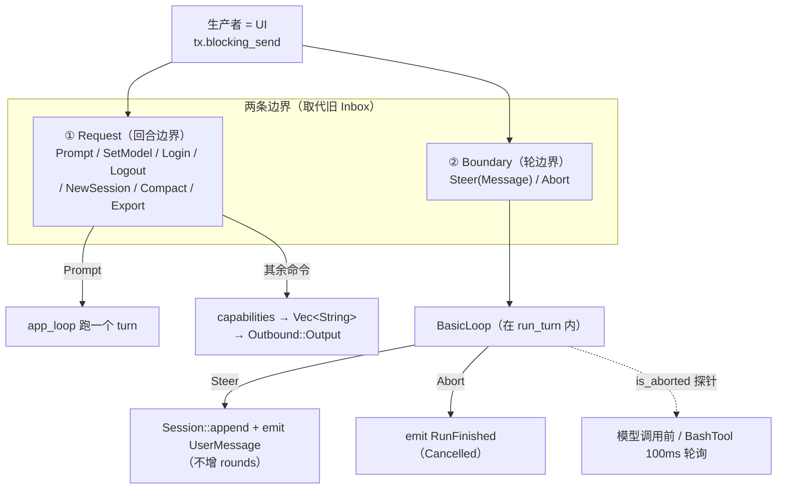

**关键性质**

| 性质 | 说明 |
|---|---|
| **取消即消息** | `Boundary::Abort` 与 `Steer` **共享同一条有序通道**；谁先到由**入队顺序**决定（旧 topology 下不确定） |
| **回合 vs 轮** | `Request` 只在回合之间被 `recv`；`Boundary` 在回合**跑动中**就被 `BasicLoop` 拉到 |
| **`Abort` 入队即置位** | `is_aborted()` 立刻为真（供「随时探针」），但**照常入队**（保序，`take` 仍会交还）；标记**不随 `take` 清除** |
| **每回合必须新建 `BoundarySource`** | 标记永久置位，复用会让「上一回合的取消」立刻取消之后每个回合；app 循环还须在空闲期丢弃残留边界消息 |
| **消息只存一份** | 不再有 pending 队列 = 转移模型；消息经 `Session::append` 落历史 |

### `BoundarySource` 与 Abort 语义

```rust
// ys-protocol，零 tokio
pub trait BoundarySource: Send + Sync {
    fn take(&self) -> Option<Boundary>;   // 轮边界：非阻塞、保序
    fn is_aborted(&self) -> bool;          // 非破坏性探针（模型调用前 / 工具轮询）
}

pub struct QueueBoundarySource { inner: Mutex<Inner { queue: VecDeque<Boundary>, aborted: bool }> }
```

- 两方法都是 **`&self`（内可变）**：`BasicLoop` 经 `&dyn BoundarySource` 访问，生产者（app 侧）
  却可并发 `push` —— 旧 `Inbox` 用 `Arc<Mutex<Inner>>` 达到同样效果，这里用 `std::sync::Mutex`
  足够（trait 对象本身可 `&` 共享；临界区只有队列操作，不跨 `await`）。
- `QueueBoundarySource` 是**唯一具体实现**；消费者侧看到的只有 trait。
- **Abort 的三条出路**（`BasicLoop`）：Step 1（入口）与 Step 3（模型调用前）用 `is_aborted()` 探针
  提前收场；Step 4b（轮边界）`take()` 到 `Abort` 是**压缩窗口的防御路径**（`await` 期间 Abort 才到）。
  命中即 `emit RunFinished{Cancelled}`。
- **工具级取消载体**：`ToolContext.boundary: Option<&dyn BoundarySource>`。`BashTool` 挂载时
  以 **100ms** 间隔轮询 `is_aborted()`，命中则杀**进程组**（`sh -c "kill -9 -{pid}"`，**不引 libc**）；
  未挂载时行为与改动前完全一致。

---

## 7. 事件信道的两条路径

`EventSink` 有两个方法，**各有明确归属**——搞混会导致死锁。本节结论在路线 B 之后**一字未改**
（`try_emit` 的实现契约与非 TUI 模式的消费路径均保持）。

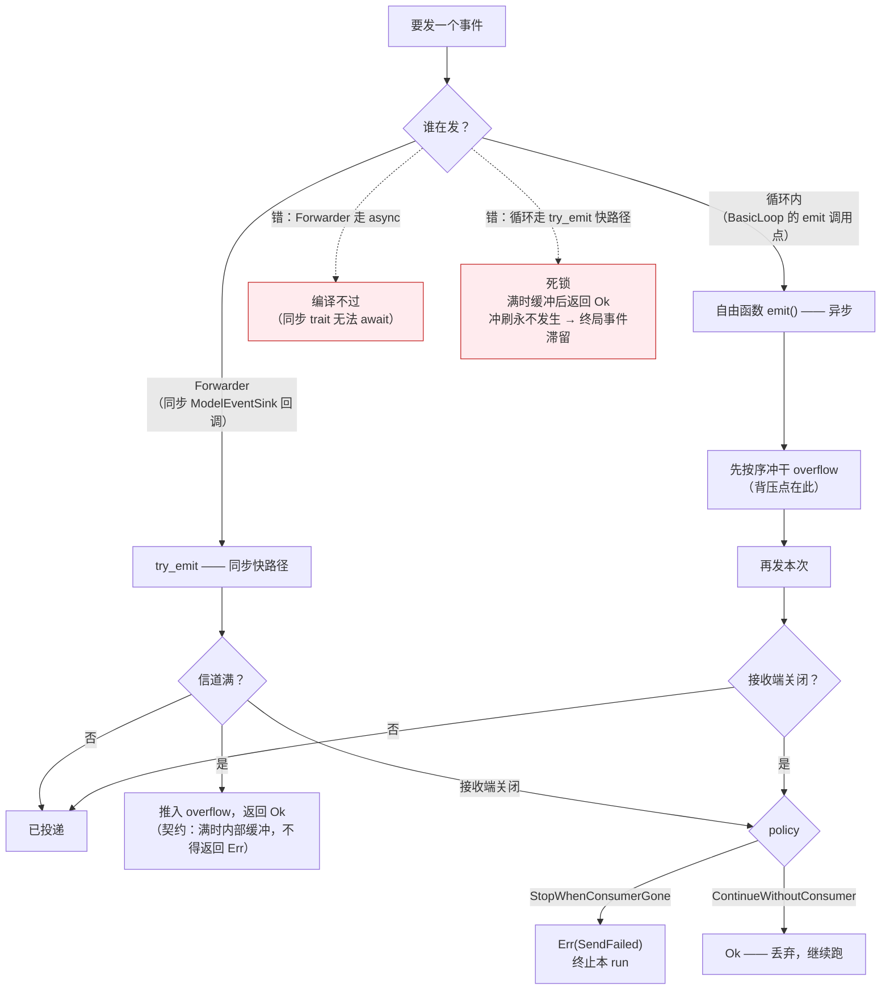

**两条铁律**（都是修过的 bug）

1. **自由函数 `emit()` 必须总走异步路径** —— 若让它先试快路径，满时 `try_emit` 缓冲后返回 `Ok`，调用方以为已投递，**冲刷永不发生** → 终局事件滞留 → 消费者等不到 → 死锁。
2. **`try_emit` 的 `Err` 仅表示「消费者已消失」** —— 信道满时实现**必须内部缓冲**。理由：同一个 `Err` 在两条路径上被相反处置（自由函数视为「走慢路径重试」，`Forwarder` 以 `let _ =` 丢弃），只有收窄成「消费者消失」二者才自洽。

**背压的作用范围**（诚实说明）

| 路径 | 满时行为 | 背压 |
|---|---|---|
| 自由函数（循环内） | 先冲 overflow（`send().await` 阻塞） | ✅ 生效 |
| `Forwarder`（同步回调） | 推入 overflow，无法 await | ❌ 不生效（overflow 上界 ≈ 单次模型响应的增量数） |

后者是「同步回调无法背压」的固有取舍，非缺陷。

---

## 8. 流式响应路径（SSE → 事件）

```mermaid
sequenceDiagram
    autonumber
    participant S as SSE 连接
    participant B as feed_sse_bytes
    participant A as StreamAccumulator
    participant K as EventSink
    participant R as ModelResponse

    loop 每个 TCP chunk（任意字节边界）
        S->>B: bytes
        B->>B: buffer.extend_from_slice(bytes)
        Note over B: 缓冲是 Vec&lt;u8&gt;，未闭合的行留在 buffer
        loop 每个完整的行（含 \n）
            B->>B: 在字节层找 b'\n'，只对完整行解码 UTF-8
            B->>A: StreamEvent::Delta
            A->>A: 累积 text / reasoning / tool_call 碎片
            A->>K: ModelEvent::TextDelta（逐块）
            A->>K: ModelEvent::ThinkingDelta（按 compat 门控）
        end
    end
    A->>R: finish() —— 组装完整 Message
    Note over R: text → ContentBlock::Text<br/>tool_calls 按 index 组装 → ToolUse<br/>usage 取末包
```

**为什么缓冲必须是字节级**：TCP 分片可能切在一个多字节字符**中间**。若对每个 chunk 单独 `from_utf8_lossy`，半个汉字会变成 U+FFFD（`你好世界` → `���好世界`）。字节级缓冲 + 只在完整行上解码，才能保证跨片字符完整。

**工具参数不进 `ModelEvent`**：设计定「工具参数不冒泡」——它按 `index` 在适配器内累积成完整 `ToolUse`，直接进 `ModelResponse`。若做成 `ModelEvent` 变体，`Forwarder` 的 `_ => Ok(())` 会吞掉它，成为 dead variant。

---

## 9. 生命周期策略

「消费者消失后怎么办」是可配策略，不是写死的规则。

```mermaid
stateDiagram-v2
    [*] --> 空闲
    空闲 --> 跑回合: ① Request::Prompt 到达
    跑回合 --> 跑回合: 还有轮（② Steer 在轮边界注入）
    跑回合 --> 判策略: 回合结束
    判策略 --> 空闲: 返回 RunResult，app_loop 继续 recv
    判策略 --> 空闲: 信道空（等下一个 Request）
    判策略 --> 消费者消失: 收发失败
    消费者消失 --> 收摊: StopWhenConsumerGone
    消费者消失 --> 继续跑: ContinueWithoutConsumer
    继续跑 --> 跑回合
    收摊 --> [*]
```

| 策略 | 消费者消失后 | 适用 |
|---|---|---|
| `StopWhenConsumerGone`（默认） | 以 `Err(LoopError::Event(SendFailed))` 终止当前 run | 交互式 CLI / TUI |
| `ContinueWithoutConsumer` | 继续跑（靠事件落盘兜底） | 后台长任务 |

**关键规则**：**消费者消失时不打断正在进行的轮** —— 干完当前轮再看策略（学 pi-server 的 *"releases its attachment only after admitted service calls settle"*）。避免把正在写的文件砍一半。

**注意「收摊」的返回类型**：是 `Err`，**不是**「与用户取消同类」——取消路径返回 `Ok(RunResult { stop_reason: Cancelled })`。二者不同。

---

## 10. 三种入口模式

三种模式**互斥**（一次跑一个），共用同一套 `Agent` 与 `Wiring`；**只有 TUI 走三信道 / 两线程**。

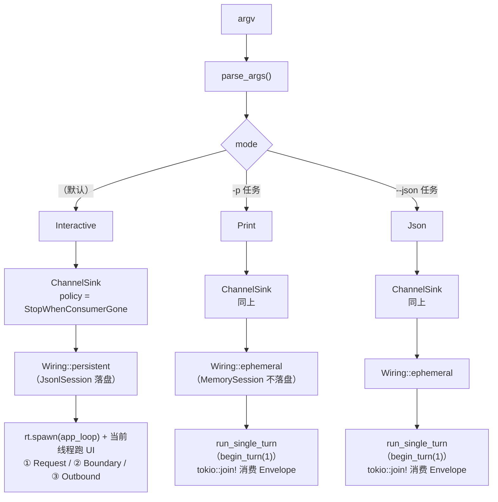

- **TUI**：`rt.spawn(app_loop)` 后，当前线程阻塞跑 `ys_tui_coding::run`（见 §2）。
- **`-p` / `--json`**：直接 `run_turn` + `begin_turn(1)`（`run_single_turn`），**不经 `Agent::run`**，
  消费端直接从 `ChannelSink` 收 `Envelope`（`-p` 取 `ModelTextDelta` 打印；`--json` 逐行序列化）。

**为什么 `-p`/`--json` 必须 `join!`**：有界信道若无**并发**消费者，agent 第一次撞满就会等待 → 死锁。

**为什么消费以「终局事件」而非「信道关闭」为终止条件**：sender 在 agent 侧（`ChannelSink` 归接线器），
不 drop 信道就不会关闭；等关闭必死锁。

**为什么 `-p`/`--json` 用 `ephemeral`**：避免把上次交互的会话历史灌进一次性任务。行为与引入前等价（此前也是 `MemorySession`）。

---

## 11. `/new` 换 Wiring

**`/new` 不是「告诉 agent 重置」，而是「换一个 `Wiring`」——agent 全程不知情。**

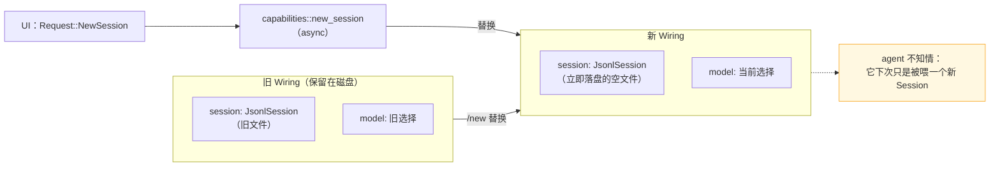

**「立即落盘空文件」是必须的**：新会话文件若惰性创建，用户 `/new` 后**没发消息就退出**，磁盘上只有旧文件 → 重启恢复到的还是旧会话 → **`/new` 等于没生效**（实测复现过的 bug）。

> 旧拓扑（2026-09-14 前）的表述是「换队列：pending 丢弃、新 `Inbox` 为空」——`Inbox` 已删，
> 现只换 `session` / `model`（`Wiring` 的两个字段）。状态行的会话时长在 `/new` 后归零。

---

## 12. 会话落盘与恢复

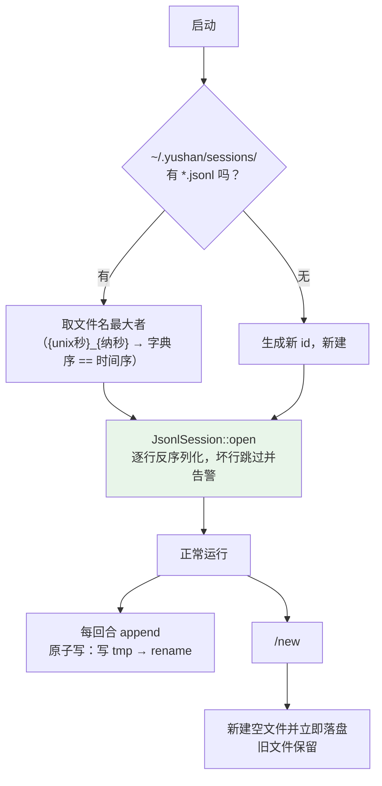

| 项 | 值 |
|---|---|
| 路径 | `~/.yushan/sessions/{unix秒}_{纳秒}.jsonl` |
| 覆盖 | 环境变量 `YUSHAN_SESSIONS_DIR`（测试用） |
| 写策略 | 原子：写 `{file}.jsonl.tmp` → `rename` |
| 损坏处理 | 跳过坏行并告警，不终止 |
| 已知缺口 | **多进程并发写同一文件无锁**（整文件重写 + 固定 tmp 名会丢更新） |

---

## 13. 输出与诊断三分

TUI 起屏后 stderr/stdout 会冲掉整屏，故按**时机**三分（解 review R2）：

| 时机 | 内容 | 去处 |
|---|---|---|
| **启动期**（TUI 未起） | 容量 clamp 警告、`No model configured` | **stderr**（照旧） |
| **命令期间**（有 TUI） | `/login` 的 "✓ Logged in…"、"Warning: Could not persist credentials" 等 | **`Outbound::Output`** → transcript |
| **库内部 / 随时** | `auth.json` / `state.json` 解析失败 | **日志文件** `~/.yushan/logs/yushan.log` |

**日志文件**（`apps/coding-agent/src/logging.rs`）：手写极简 logger —— 追加写、行首 `[unix秒]` 前缀、
**best-effort**（目录创建 / 打开 / 写入的任何 IO 错误一律静默忽略，返回值 `()`，不 panic、不传播）。
**不引新依赖**。`app_loop` 也用它记录「回合失败」与「app 循环异常退出」（不打扰用户）。

> **只有 2 处（`provider.rs` / `state.rs`）严格需要日志文件** —— 其余靠「启动期 stderr / 命令期
> `Output`」就够。日志文件的价值是**通用兜底**：TUI 应用没有「历史输出」可看。

**`capabilities.rs` 绝不 print** —— 命令期间的失败也走 `Output`。
`--stats` 的背压读数**只在非 TUI 模式**出现，写 stderr，不污染 stdout 的 JSON / 文本流。

---

## 14. `ys-tui-coding` 形态与命令分工

**表在 TUI 侧**（`crates/ys-tui-coding/src/commands.rs`，11 条 `CommandSpec`）：命令的**用户可见行为**
（提示什么、问什么）归 UI；**能力实现**归 app（`capabilities.rs`）。二者唯一契约是 `Request` ——
漏实现是**编译错误**（app 循环对 `Request` 的 `match` 必须穷尽），不会静默漂移。

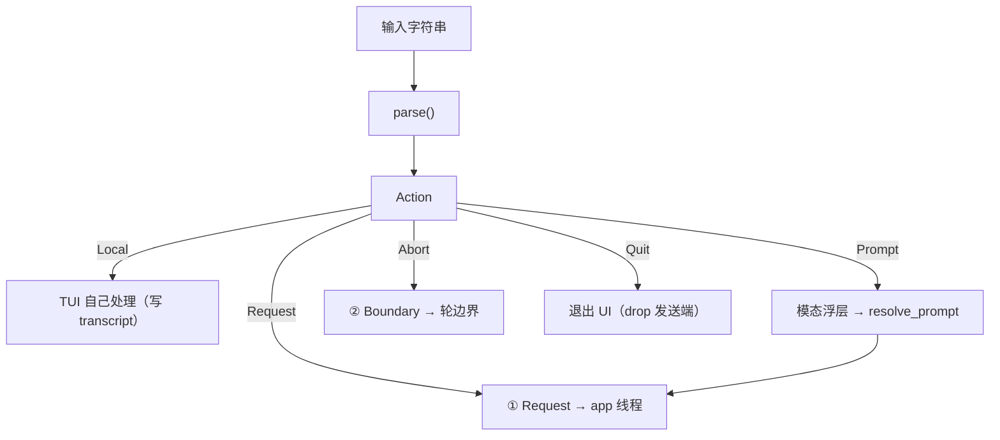

| 命令 | TUI 做什么 | 发给 app |
|---|---|---|
| `/help [command]` | 本地打印命令表（有参只给该条） | — |
| `/status` | 本地（`CodingView` 在 TUI 手里） | — |
| `/copy` | 本地（最后一条 assistant 回复写进 transcript，**无剪贴板依赖**） | — |
| `/quit` | 本地 | — |
| `/thinking [on\|off]` | 本地开关（thinking 默认隐藏，开启后暗色渲染） | — |
| `/model [name]` | 无参时**浮层选择**（`available_models`） | `SetModel` |
| `/login` | **问 provider / api_key**（`Prompter` 浮层） | `Login` |
| `/logout` | — | `Logout` |
| `/new` | — | `NewSession` |
| `/compact` | — | `Compact` |
| `/export [path]` | — | `Export` |

**`Prompter` trait 保留**：`select` / `text` 是「选择器可测」的答案。**决策逻辑**抽在纯函数
`resolve_prompt(PromptKind, &dyn Prompter, &CodingView)` 里，单测注入 `FakePrompter`；TUI 实现
`TuiPrompter` 把同一套问答画成嵌套事件循环的模态浮层。任一问答步骤取消 → **不产生任何 `Request`**。

**app 侧能力**（`apps/coding-agent/src/capabilities.rs`）：`login` / `logout` / `set_model` /
`new_session` / `compact` / `export`，每个返回 `Vec<String>`（每项一行），由 `app_loop` 包成
`Outbound::Output`。

### UI 形态

| pane | 约束 | 说明 |
|---|---|---|
| **Chat** | `Constraint::Min(3)` | 唯一可滚动区域；滚动以 **wrap 后的视觉行**为单位 |
| **Input** | `Constraint::Length(1..=5)` | 高度随内容自适应（`INPUT_MAX_LINES = 5`） |
| **Status** | `Constraint::Length(1)` | **最底**，常驻一行 |

补全浮层 / 模态选择器**独立于三 pane**（`Clear` 后盖在 Chat 区域上）。要点：

- **对话区**：`TranscriptLine` 结构化（`User` / `Assistant` / `Thinking` / `Tool{…}` / `Summary` /
  `Error` / `System`）；工具调用压一行，摘要由 `summarize_tool_args` 抽取（摘要规则属产品知识，故在
  TUI crate 而非协议）。
- **状态行**：`model · ↑↓tokens · N 轮 · 时长`，窄屏**从尾部剥**；turn 中把 model 段换成
  `⏳ Working·`（300ms 节拍前进）。
- **输入区**：多行（`Shift/Alt+Enter` 换行、`Enter` 提交）；启用 bracketed paste（`Event::Paste`
  原样 `insert_str`）；`InputBuffer.cursor` 是 **char 索引**，退格走字节边界求区间再 `replace_range`
  —— 修掉了旧 `ui/events.rs:131` 的 `cursor - 1` 落在多字节字符中间导致的**中文退格 panic**。
- **退出**：无条件恢复终端 —— 把完整对话 wrap 后逐行写回**主屏 scrollback**，再离开 alt-screen。

---

## 15. 附录：测试分层

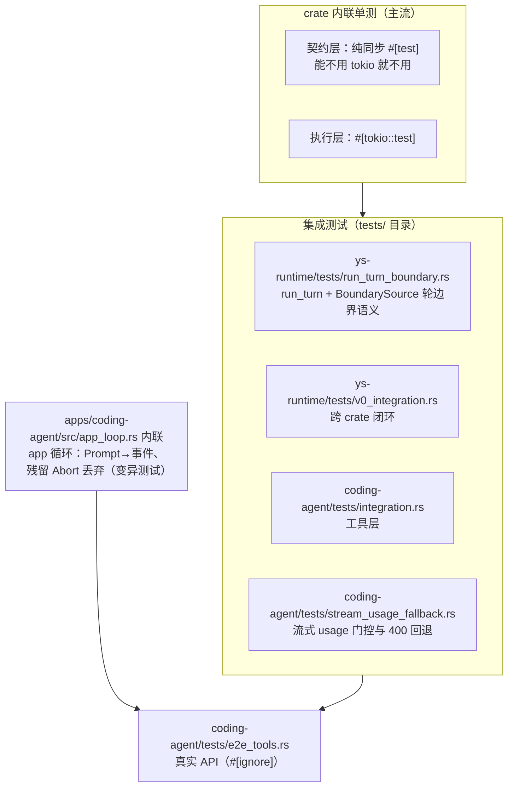

**测试替身（均为生产导出，供跨 crate 复用）**

| 替身 | 位置 | 用途 |
|---|---|---|
| `MockModel` | `ys-model` | 预写响应队列（`push_text` / `push_tool_call` / `push_error`） |
| `CollectingSink` | `ys-event` | 收集 `AgentEvent` 供断言 |
| `NoopEventSink` | `ys-event` | 静默丢弃 |
| `FailingSink` | `ys-event` | 第 N 次起失败（覆盖「消费者消失」路径） |
| `MemorySession` | `ys-session` | 内存会话 |
| `FakePrompter` | `ys-tui-coding` | 注入模态问答路径（`resolve_prompt` 单测） |

**删 / 搬（2026-09-14）**：`ys-channel` 的全部单测（`Inbox`/`Intent`/`QueueMode` 语义消失）；
`ys-runtime/tests/actor_run.rs`（7 条，测已删的 `Agent::run` 自转）；app 旧 `ui/` 模块的渲染断言
（重写进 `ys-tui-coding`）。多回合语义的等价覆盖落在 `app_loop.rs` 内联测试与
`crates/ys-runtime/tests/run_turn_boundary.rs`。

**两条并行安全的纪律**（都是踩过坑的）

- 临时目录名必须含**进程内原子序号 + `process::id()`** —— macOS 的 `as_nanos()` 只到微秒级，并行测试会撞名，先完成者的 `remove_dir_all` 会删掉他人的文件
- 进程级 env 改写必须走 `test_env::env_lock()` + `EnvRestore`（RAII 恢复）—— 直接 `set_var` 散在测试里会造成 `getenv`/`unsetenv` 数据竞争

**一条方法论**：关键逻辑要做**变异测试**（注入 bug 验证测试能抓到）。本项目多个真 bug（死锁、跨分片 UTF-8 损坏、`/new` 失效）**都是「测试全绿时依然存在」**，靠变异测试与端到端复现才暴露。
