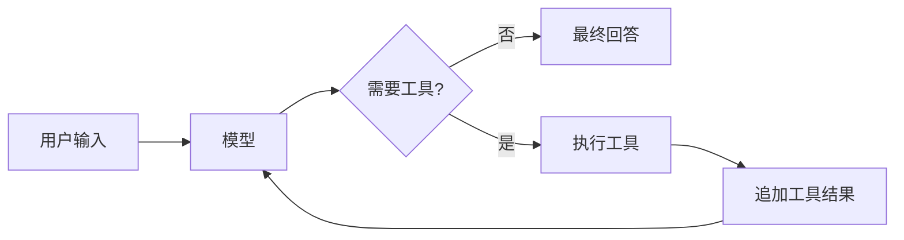
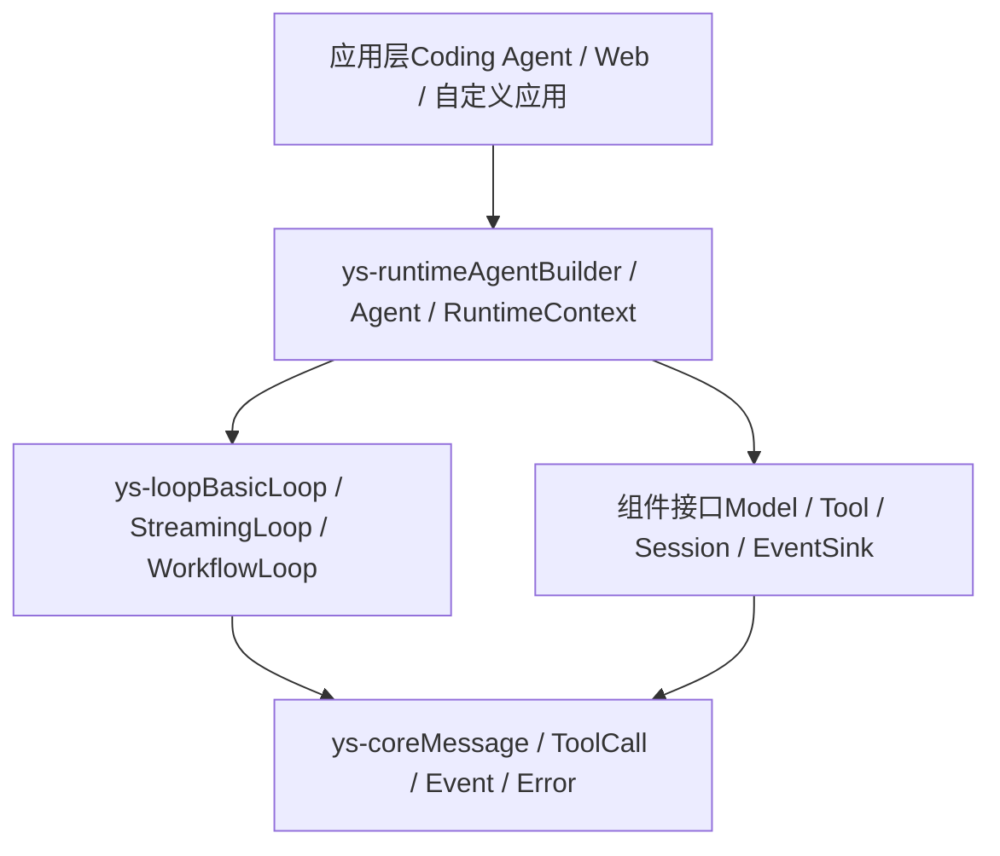
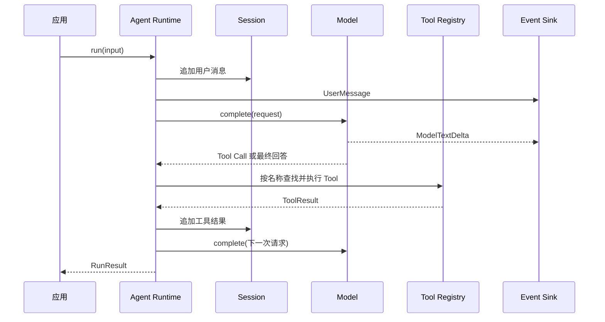
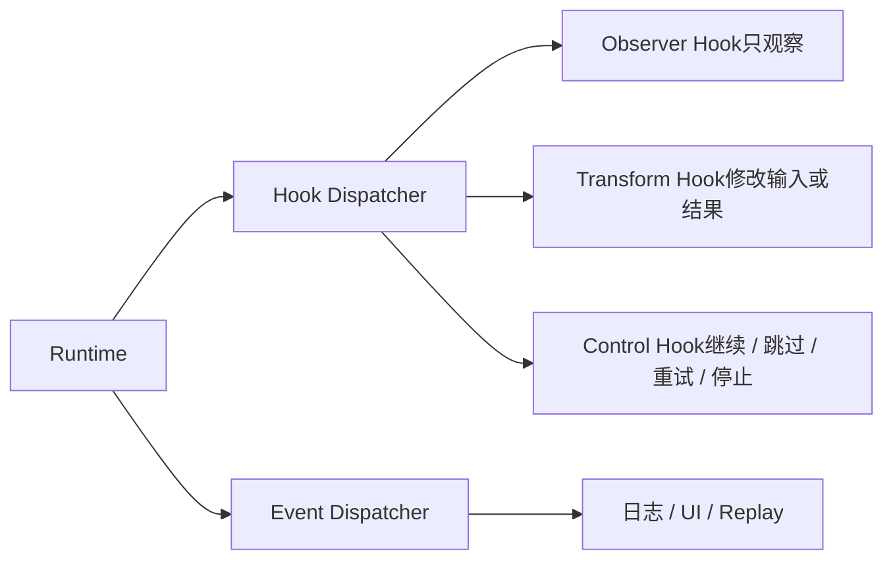
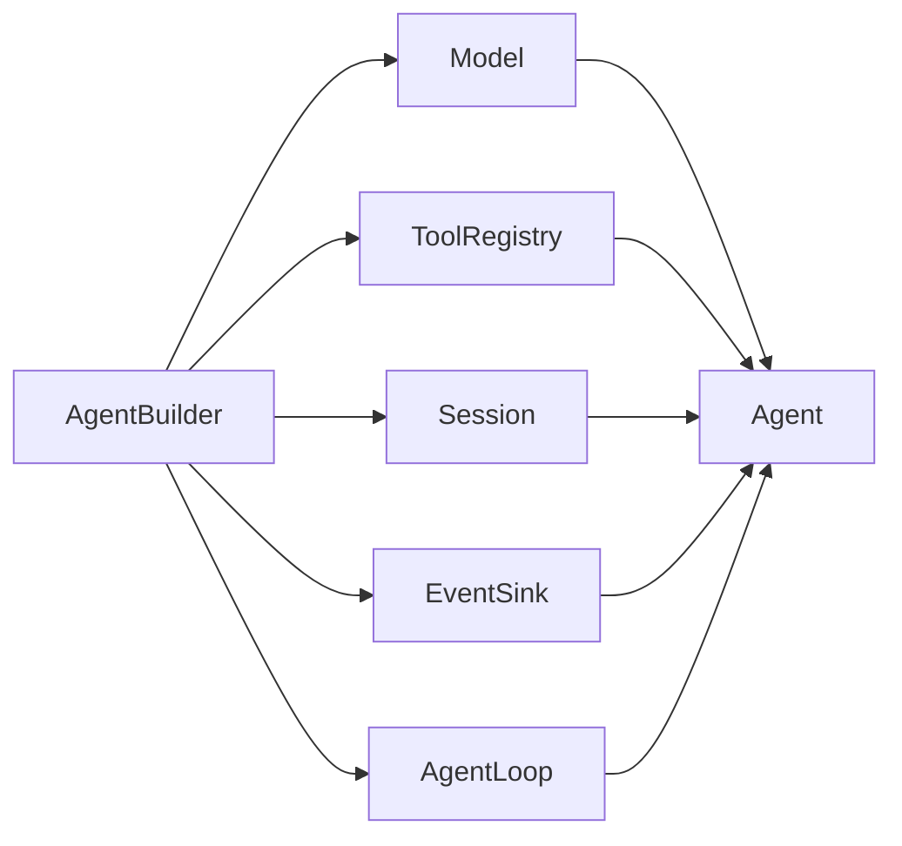
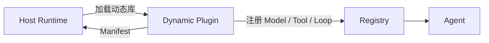
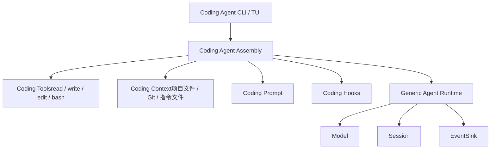

# Rust 组件化 Agent 设计

> 一个用于组装 Agent 的轻量 Rust Runtime，而不是一个自带所有功能的完整 Agent 产品。

本文说明一个轻量、可组合、可静态编译，也可通过动态插件扩展的 Rust Agent 组件设计。项目只负责模型调用、消息状态、工具调用循环和事件流；沙箱、隔离、权限、审批和多租户安全由其他项目独立解决。

## 1. 最小闭环

Agent 的最小工作方式只有一个循环：把用户输入交给模型；模型如果需要工具，就执行工具并把结果交还给模型；模型给出最终回答后结束本轮。



| Runtime 负责 | 外部项目负责 |
| --- | --- |
| 消息、上下文和模型调用 | 沙箱、隔离和权限 |
| 工具注册与调用 | 审批和多租户安全 |
| Agent Loop 与运行事件 | 业务级工作流 |
| Session 持久化接口 | 具体存储部署策略 |

## 2. 核心原则

### 核心最小化

默认只提供完成一次 Agent Turn 所需的能力：模型、工具、内存上下文、基本 Loop 和事件出口。文件系统、Shell、数据库、TUI、MCP、记忆和子 Agent 都是可选组件。

### 静态组合优先

普通应用优先通过 Cargo crate 和 feature 组合能力，只编译实际使用的组件。

### 执行与状态分离

`AgentLoop` 决定下一步做什么，`Session` 保存已经发生了什么，`Model` 和 `Tool` 分别提供外部能力。

### 事件是一等接口

模型增量、工具调用、工具结果、错误和运行完成都通过事件流暴露；事件可以同时用于 UI、日志、持久化、测试和回放。

### Loop 可以替换

基础版本提供 `BasicLoop`，后续可增加流式、工作流、规划或回放 Loop，而不修改 Model、Tool 和 Session 接口。

### 安全策略外置

本项目不定义沙箱、权限、审批和隔离抽象。需要这些能力的上层项目可以包装 Tool 或替换 Runtime。

## 3. 整体架构



依赖方向保持单向：

```text
ys-core
  ↑
ys-model / ys-tool / ys-session / ys-event
  ↑
ys-loop / ys-runtime
  ↑
Coding Agent / UI / 适配器 / 插件
```

`ys-core` 不依赖 Tokio、HTTP Client、数据库、TUI 或具体模型 SDK。

## 4. 运行时组件关系



### `ys-core`

定义所有组件共享的稳定数据：

```rust
pub struct Message {
    pub role: Role,
    pub content: Vec<ContentBlock>,
}

pub enum ContentBlock {
    Text(String),
    ToolCall(ToolCall),
    ToolResult(ToolResult),
}

pub struct ToolCall {
    pub id: ToolCallId,
    pub name: String,
    pub arguments: serde_json::Value,
}
```

核心类型还包括 `ModelRequest`、`ModelResponse`、`Usage`、`AgentEvent`、`AgentError`、`SessionError` 和各类 ID。

### `ys-model`

模型只负责把请求转换成模型响应，并可输出增量事件：

```rust
#[async_trait]
pub trait Model: Send + Sync {
    fn model_id(&self) -> &str;

    async fn complete(
        &self,
        request: ModelRequest,
        sink: &mut dyn ModelEventSink,
    ) -> Result<ModelResponse, ModelError>;
}
```

`ModelEventSink` 是模型侧窄事件口（只承载模型事件），与 run 级 `EventSink` 分离，为动态插件保持模型适配器的最小 ABI 面（ADR-0004）。适配器单独实现，例如 `ys-model-openai-compat`、`ys-model-deepseek` 和 `ys-model-ollama`。

### `ys-tool`

工具只描述自身并执行输入：

```rust
#[async_trait]
pub trait Tool: Send + Sync {
    fn spec(&self) -> ToolSpec;

    async fn call(
        &self,
        input: serde_json::Value,
        ctx: ToolContext<'_>,
    ) -> Result<ToolResult, ToolError>;
}
```

`ToolSpec` 至少包含 `name`、`description` 和 `input_schema`。`ToolRegistry` 只负责按名称查找工具，不负责权限判断。`ToolContext` 至少携带取消句柄，工具可自愿检查，Loop 不会强制中断执行中的工具。

### `ys-session` 与 `ys-event`

```rust
pub trait Session {
    fn messages(&self) -> &[Message];

    async fn append(&mut self, message: Message) -> Result<(), SessionError>;
}

pub trait EventSink: Send {
    fn emit(&mut self, event: AgentEvent) -> Result<(), EventError>;
}
```

首批 Session 实现为 `MemorySession`、`JsonlSessionStore` 和可选的 `SqliteSessionStore`。默认 EventSink 为 `NoopEventSink`。

`EventSink` 是异步推式出口：emit 失败即终止 run，信道满时等待以背压反作用于上游；每个 run 恰好一个终局事件（RunFinished / RunFailed），信道为有界、容量可配，传递 `Envelope { source, turn, event }`（ADR-0009 修订 ADR-0004 的同步定义）。

## 5. Agent Loop

`AgentLoop` 是可替换的执行策略：

```rust
#[async_trait]
pub trait AgentLoop: Send + Sync {
    async fn run_turn(
        &self,
        input: AgentInput,
        ctx: &mut RuntimeContext<'_>,
    ) -> Result<RunResult, LoopError>;
}
```

`BasicLoop` 的行为是：

```text
接收输入 → 写入 Session → 调用 Model → 输出事件
  → 无 Tool Call：完成本轮
  → 有 Tool Call：查找并执行 Tool
  → 写入 Tool Result → 回到 Model
```

### 失败与终止语义

```text
工具返回错误结果（含请求了未注册的工具）→ 作为错误 ToolResult 回喂模型，计入轮数
ToolError（工具无法产出可回喂的结果）   → 终止回合，返回 LoopError
达到最大轮数                            → 正常结束，StopReason = MaxRounds
取消（步骤边界检查）                    → 正常结束，StopReason = Cancelled
EventSink 发送失败                      → 终止回合（观察者不阻断属于后续 Hook 阶段的语义）
```

`RunResult` 携带终止原因、累计 `Usage`、轮数和最终消息（仅 Completed 时为 Some）；错误路径经 `Err(LoopError)` 返回，不产生 `RunResult`。错误回喂与协作式取消的决策记录见 ADR-0001 与 ADR-0002，终局事件不变式见 ADR-0004。

## 6. Runtime Hook

插件除了注册 Model、Tool 和 Loop，也可以订阅 Runtime 提供的 Hook。Hook 用于参与生命周期；Event 只用于观察已经发生的事情。



### Hook 点

```text
before_model_request
after_model_response
before_tool_call
after_tool_result
before_session_append
turn_finished
run_finished
run_failed
```

| Hook 类型 | 能力  | 典型用途 |
| --- | --- | --- |
| Observer | 只观察，不改变流程 | 日志、统计、UI 推送 |
| Transform | 返回修改后的数据 | 注入上下文、追加提示、结果整理 |
| Control | 决定下一步行为 | 重试、短路、去重、提前结束 |

Hook 不直接持有可变的 `Agent`，而是通过明确的输入、输出和决策参与流程：

```rust
pub enum HookDecision {
    Continue,
    Skip,
    Retry,
    Stop(RunResult),
}

#[async_trait]
pub trait RuntimeHook: Send + Sync {
    async fn before_model_request(
        &self,
        request: ModelRequest,
        ctx: &mut HookContext<'_>,
    ) -> Result<ModelRequest, HookError>;
}
```

多个 Hook 按优先级升序执行；优先级相同时按注册顺序执行。Observer Hook 出错时记录并继续，Transform Hook 出错时终止当前阶段，Control Hook 的结果由 Runtime 执行。

Hook 和 Event 的边界是：

```text
Event：发生了什么
Hook：下一步怎么处理
Component：谁来提供能力
Loop：按什么规则推进
```

静态插件直接注册 Rust Hook，动态插件通过 ABI 注册 Hook Adapter。第一版只支持启动时注册，不支持 Agent 运行期间热插拔或热卸载。

## 7. 静态组合

```rust
let agent = AgentBuilder::new()
    .model(model)
    .tool(ReadFileTool::new())
    .tool(WriteFileTool::new())
    .session(MemorySession::new())
    .events(NoopEventSink::new())
    .build();
```



建议通过 Cargo features 控制可选依赖：

```toml
[features]
default = ["runtime-tokio"]
runtime-tokio = ["dep:tokio"]
model-openai-compatible = ["dep:ys-model-openai-compat"]
session-jsonl = ["dep:ys-session-jsonl"]
session-sqlite = ["dep:ys-session-sqlite"]
```

**运行时依赖边界（ADR-0012）**：不宜对 tokio 做 feature 门控。实际边界是——**纯契约层**（`ys-core`/`ys-event`/`ys-channel`/`ys-component`）保持运行时无关；**执行层**（`ys-session`/`ys-loop`/`ys-runtime`）可直接依赖 tokio。上表 `runtime-tokio` 一项**不实施**。

## 8. 动态插件

动态插件用于运行时扩展，不承担安全边界：



插件入口保持最小：

```text
plugin_manifest
plugin_init
plugin_register
plugin_shutdown
```

静态组件使用 Rust trait；动态库使用稳定 ABI 和序列化数据。不要直接跨动态库传递 Rust trait object、Tokio 类型或跨库所有权对象。

插件可以注册 Model、Tool、Loop、SessionStore、EventSink 或 Runtime Hook。Hook 的动态调用由宿主侧 Adapter 包装，BasicLoop 不需要知道 Hook 来自静态 crate 还是动态库。

## 9. Crate 结构

```text
agent/
├── crates/
│   ├── ys-core/              # 基础数据类型
│   ├── ys-component/         # Component 与 Registry
│   ├── ys-model/             # Model 接口
│   ├── ys-tool/              # Tool 与 ToolRegistry
│   ├── ys-session/           # Session 接口
│   ├── ys-event/             # AgentEvent 与 EventSink
│   ├── ys-loop/              # AgentLoop 与 BasicLoop
│   ├── ys-runtime/           # AgentBuilder 与 Agent
│   ├── ys-plugin-api/        # 动态插件 ABI
│   └── ys-plugin-loader/     # 动态库加载器
├── adapters/
│   ├── model-openai-compatible/
│   ├── model-deepseek/
│   ├── tools-basic/
│   └── session-jsonl/
└── apps/
    └── coding-agent/
```

## 10. Coding Agent 产品层

Coding Agent 是通用 Runtime 之上的独立产品组合，不把文件编辑、Shell、Git、项目上下文或 TUI 放进通用核心。



### 产品边界

| 通用 Runtime | Coding Agent |
| --- | --- |
| Model、Tool、Session 接口 | Coding Prompt 和默认配置 |
| BasicLoop、Event、Hook | 项目上下文发现 |
| Registry 和插件加载 | read、write、edit、bash |
| 通用消息和运行状态 | CLI、TUI 和 coding session |

第一版优先使用 `BasicLoop + Coding Tools + Coding Hooks + Coding Prompt`。只有在需要自动验证、失败修复、特殊压缩或任务阶段管理时，才增加独立的 `CodingLoop`。

### 默认工具

| 工具  | 职责  |
| --- | --- |
| `read` | 读取完整文件或指定片段 |
| `write` | 创建文件或完整覆盖内容 |
| `edit` | 对已有文件执行精确修改 |
| `bash` | 执行命令并返回标准输出、错误和退出码 |

第二阶段可增加 `grep`、`find`、`ls` 和 `git`。工具仍实现通用 `Tool` 接口，Runtime 不感知 Coding 语义。

### 项目上下文与 Coding Prompt

`CodingContextProvider` 负责按需发现当前工作目录、项目根目录、`AGENTS.md`、`CLAUDE.md`、`README.md`、`Cargo.toml`、`package.json`、Git 状态和用户显式提供的文件。

```rust
#[async_trait]
pub trait ContextProvider: Send + Sync {
    async fn provide(
        &self,
        request: &ContextRequest,
    ) -> Result<Vec<ContextItem>, ContextError>;
}
```

上下文通过 `before_model_request` Hook 注入，不写入通用 Runtime。Coding Prompt 同样由独立 Renderer 生成。

### Coding Hooks

```text
before_model_request  → 注入项目上下文和 Coding Prompt
before_tool_call      → 更新操作状态和界面
after_tool_result     → 整理命令或编译错误
turn_finished         → 更新会话状态
run_finished          → 生成变更与验证摘要
```

### 会话与入口模式

Coding Session 在通用消息之外记录工作目录、模型、Git 分支、Agent 配置和上下文压缩信息。建议提供四种入口：

```text
ys-coding-agent                 交互式 TUI
ys-coding-agent -p "task"       单次 Print 模式
ys-coding-agent --json          JSON 事件模式
ys-coding-agent --rpc           RPC 集成模式
```

第一版必须支持交互式 CLI、Print 模式和 JSON 事件模式；TUI、RPC、会话分支和上下文压缩可以后续增加。

**会话归属（ADR-0010）**：会话由接线器持有，不由 Agent 持有。`/new` 是**换一条会话日志**（agent 不知情）；队列即该日志「处理到哪了」游标之后的视图。详见 `docs/arch/gap-closure/context.md`。

### Coding Agent 组装

```rust
let agent = AgentBuilder::new()
    .model(model)
    .tool(ReadTool::new(workspace.clone()))
    .tool(WriteTool::new(workspace.clone()))
    .tool(EditTool::new(workspace.clone()))
    .tool(BashTool::new(workspace.clone()))
    .hook(ProjectContextHook::new(context_provider))
    .hook(CodingPromptHook::new(prompt_renderer))
    .session(session)      // 会话实例；agent 不持有其所有权语义，见 ADR-0010
    .events(events)        // 事件出口；异步推式，见 ADR-0009
    .build();
```

**事件出口（ADR-0009）**：`EventSink::emit` 为异步；信道有界、容量可配，传递 `Envelope { source, turn, event }`。消费者可为 `-p` / `--json` / TUI / 回放。

## 11. 实现路线

1. **最小闭环**：实现 Core、Model、Tool、Session、Event、Loop、最小 ToolRegistry 和 Runtime；Mock Model 可以完成文本回复和 Tool Call。

2. **可用适配器**：增加 OpenAI-compatible、DeepSeek 和 JSONL Session。

3. **静态组件生态**：扩展 Registry、增加可替换 Loop、SQLite Session、UI 适配器和 Runtime Hook Dispatcher。

4. **动态插件**：增加 Manifest、稳定 ABI、动态库加载、组件注册和 Hook Adapter。

5. **Coding Agent MVP**：组装 Coding Prompt、项目上下文、read/write/edit/bash、Print 模式和 JSON 事件模式。


## 12. 测试矩阵

| 模块  | 重点测试 |
| --- | --- |
| `ys-core` | 消息、Tool Call、事件和序列化 |
| `BasicLoop` | 文本回复、工具调用、模型错误、工具错误、取消、最大轮数、增量拼接与终态消息一致 |
| `Registry` | 注册、查找、重复名称和缺失组件 |
| `Session` | 追加消息、保存恢复、空会话和损坏数据 |
| `EventSink` | 事件顺序、失败传播和 Noop Sink |
| `HookDispatcher` | Hook 顺序、Observer 错误、Transform 修改和 Control 决策 |
| 动态插件 | Manifest、ABI 版本、组件注册、Hook 注册、初始化失败和生命周期 |
| Coding Agent | 项目上下文发现、四个默认工具、Print 模式、JSON 事件和会话恢复；TUI：turn 活渲染（提交即见 + Working 动画 + Turn 行）、事件路径取消、slash 命令时 TUI 让位（真实终端执行）、退出打印完整对话、单键退出、默认仅对话窗口（status/footer 可选面板） |

## 13. 总结

```text
用最小的核心类型表达 Agent 状态，
用独立组件提供模型和工具，
用可替换 Loop 驱动执行，
用事件流连接 UI、日志和持久化，
用 Hook 参与生命周期和流程控制，
用静态编译获得轻量性，
用动态插件获得可扩展性，
用独立 Coding Agent 组合提供代码开发体验。
```